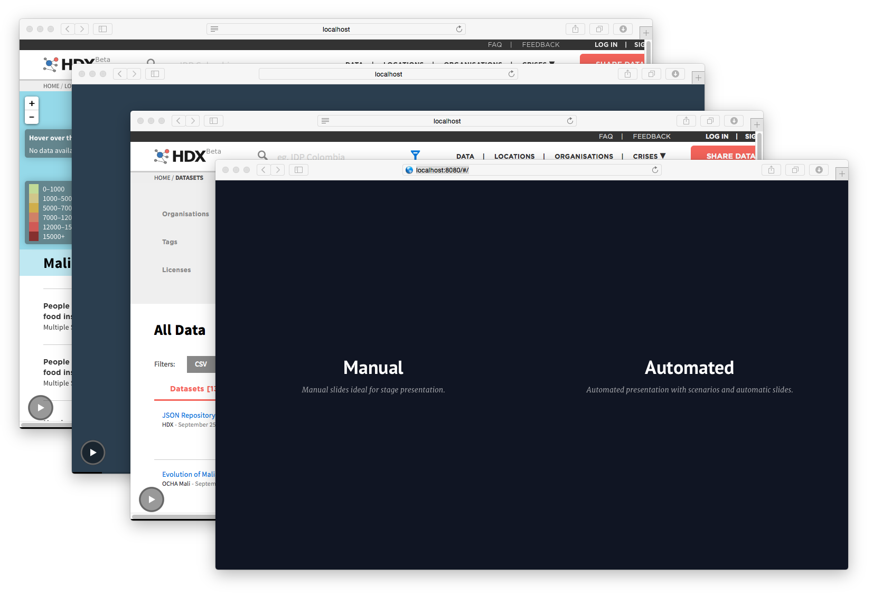

## HDX HTML Presentation


Presentation about the [Humanitarian Data Exchange](https://data.hdx.rwlabs.org) project by the [United Nations Office for the Coordination of Humanitarian Affairs (OCHA)](http://unocha.org/). The presentation goes over the main HDX features, the contribute data flow, etc. and mentions about the API and media coverage. It contains two modes: Manual or Automated. Manual is ideal for flipping slides during a presentation. Automated is ideal for letting the presentation run in a booth or a monitor somewhere.

The presentation can be accessed in the following URL:

<!-- * http://luiscape.github.io/hdx-presentation/ -->

## Usage
If not loaded directly from [GitHub Pages](https://pages.github.com/), the presentation will need to be run from an HTTP server locally. After cloning this repository, navigate to its folder, and run:

```
$ npm install -g http-server
$ http-server
```

That should start a server on `http://localhost:8080`.

You can also use Python

```
$ python -m http.server
```

That should start a server on `http://localhost:8000`.
